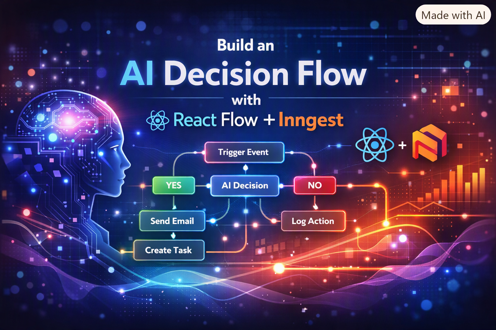
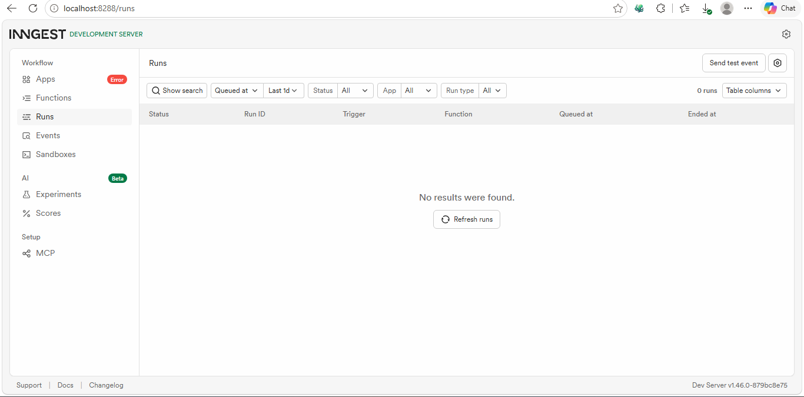
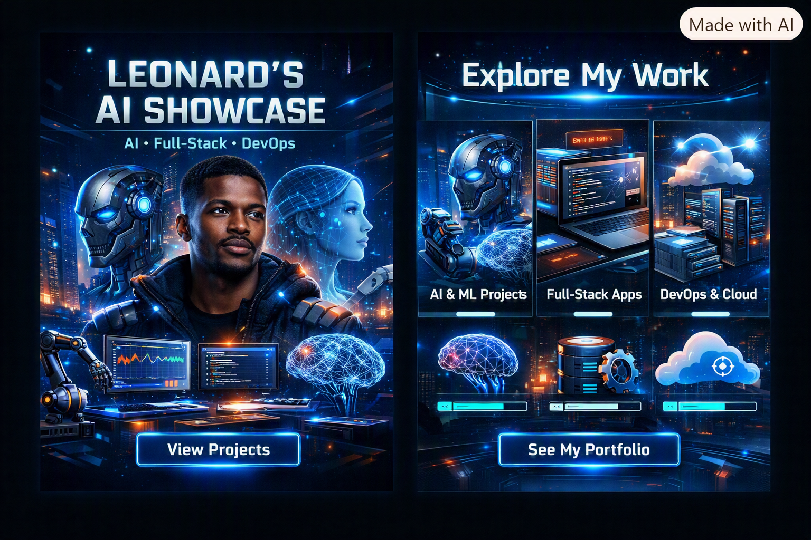
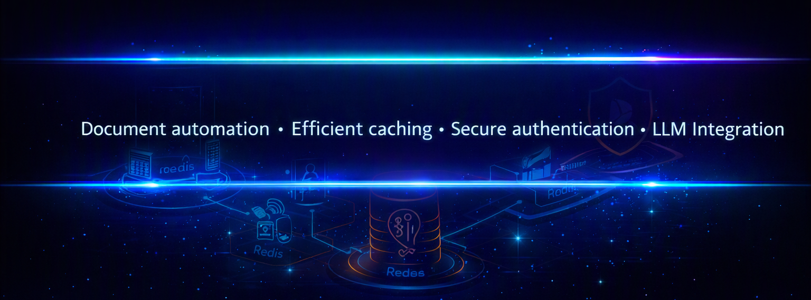

# Visual AI Flow 🚀


An event-driven AI workflow built with **Next.js**, **Inngest**, and **OpenAI**.  
Each node represents an AI decision step (YES/NO) and workflows are executed via Inngest while visualized in React Flow.

---

## ✨ Features
- Visual workflow editor powered by React Flow.
- Event-driven execution with Inngest.
- AI-powered branching logic using OpenAI GPT-4o-mini.
- Local development with Inngest dev server.

---

## ⚙️ Setup

1. **Clone and install dependencies**
   ```bash
   git clone https://github.com/your-username/visual-ai-flow.git
   cd visual-ai-flow
   npm install


---


### 2. Add environment variables in .env.local:

env
```bash
OPENAI_API_KEY=your-openai-key
INNGEST_EVENT_KEY=dev
```

### 3. Start Next.js:

```bash
npm run dev

```

### 4. Start Inngest dev server (attach to Next.js route):

```bash
npx inngest dev -u http://localhost:3000/api/inngest
```

---

## 🧪 Testing
Run the test script to send an event:

```bash
npx tsx scripts/test-event.ts
```

- Expected output:

- Event logged in Inngest dev server terminal.

Workflow executed with AI decision returned.


---

## 🛠️ Troubleshooting
- **Timeouts**: Ensure dev server is attached to Next.js route 
```bash
npx inngest dev -u http://localhost:3000/api/inngest

```

- **No events received**: Confirm `/api/inngest` is reachable:

```bash
curl http://localhost:3000/api/inngest

```

---

## 📸 Workflow Execution Screenshot



---

## 📦 Deployment
For production, configure Inngest cloud and update apiBaseUrl accordingly.

---


### 🌟 Portfolio Highlight

  
✅ **Backend AI Engineer** — I design and ship production AI systems — from optimized models and ML pipelines to full-stack React/Node apps running on automated, containerized infrastructure. I turn research into reliable, measurable software.

---



© 2026 Leonard Phokane | All rights reserved.

